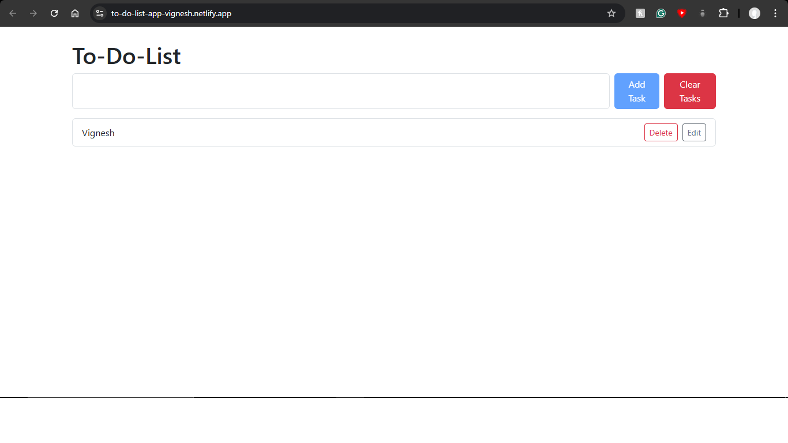

---

# 📝 To-Do List App

A simple and elegant **To-Do List App** built with **React**, **TypeScript**, and **Vite**. It allows users to add, edit, delete, and clear tasks, with persistent storage using **localStorage**. The latest tasks appear at the top of the list for quick access.

### 🚀 Live Demo  
👉 [Check it out on Netlify](https://to-do-list-app-vignesh.netlify.app/)

---

## 📸 Screenshot



---

## ✨ Features

- ✅ Add new tasks  
- ✏️ Edit existing tasks  
- 🗑️ Delete individual tasks  
- ❌ Clear all tasks  
- 💾 Tasks saved in localStorage  
- 🔁 Most recent task appears first

---

## 🛠️ Tech Stack

- React  
- TypeScript  
- Vite  
- Bootstrap (for styling)

---

## 📂 Project Setup

```bash
# Install dependencies
npm install

# Run the development server
npm run dev

# Build for production
npm run build
```

---

## 📁 Folder Structure

```
To-Do-List-App/
├── public/
├── src/
│   └── App.tsx
├── index.html
├── package.json
└── vite.config.ts
```

---

## 📄 License

This project is open-source and available under the [MIT License](LICENSE).

---

